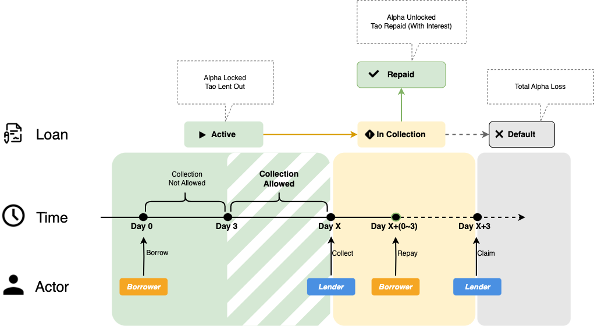

  

# Introduction

> Welcome to the Taolend (taolend.io) documentation!

## About Taolend

Taolend is purpose-built for the Bittensor economy, providing a peer-to-peer (P2P) lending platform where lenders create offers and borrowers select offers with the best conditions.

Loans have **no fixed duration**. Loans cannot be collected within the first 3 days after initiation (collection protection period). After this period, lenders are allowed, but not forced, to initiate collection. Interest is calculated **per block**.

Once a loan enters collection, borrowers have a **3-day** collection grace period to repay. Failure to repay within this period results in liquidation and loss of all ALPHA collateral. Borrowers may **Repay** or **Refinance** at any time before liquidation.

> ❗️Important Notice: After the initial 3-day protection period, a loan may enter collection at any time. Borrowers are strongly advised to monitor their loan status closely and pay attention to email notifications to avoid missing critical actions.

## Loan Life Cycle

  

## Quick Navigation

### Getting Started
- [Quick Start](quick-start.md) - Get started with Taolend in just 5 minutes
- [Platform Overview](platform-overview.md) - A deep dive into platform features and core mechanisms
- [Account & Registration](account/README.md) - Learn how to create an account and manage your assets

### Core Functions
- [Lend](core-features/lend.md) - Learn how to deposit assets and earn interest
- [Borrow](core-features/borrow.md) - Learn how to borrow TAO using ALPHA as collateral

### Advanced Content
- [Platform Rewards](https://github.com/xpenlab/taolend/blob/main/README.md) - Learn about reward mechanisms and incentive programs
- [FAQ](faq.md) - Quickly find answers to common questions

**Recommendations**:
- Do not invest funds beyond your risk tolerance
- Fully understand the lending and borrowing mechanics before participating
- Closely monitor the health of your active loans
- Safeguard your wallet private keys and recovery phrases

## Get Started

### New Users

👉 [Quick Start Guide](quick-start.md) - Get started with Taolend in just 5 minutes

### Need Help

- 📚 FAQ - [Find answers to common questions](faq.md)
- 💬 Discord - [Join the community discussion](https://discord.gg/DNeq2fWCQW)
- 📧 Email Support - support@taolend.io

---

> **Disclaimer**: This documentation is provided for informational purposes only and does not constitute investment advice. Participation in decentralized finance protocols involves risk. Please evaluate carefully before making any decisions.