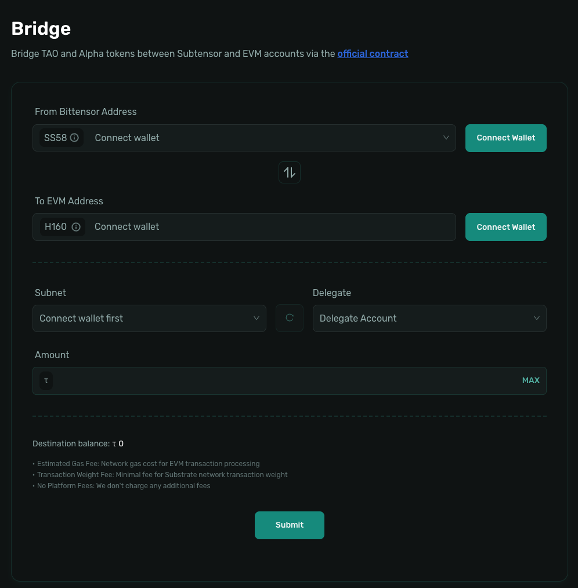

# Bridge Assets

>Before using Taolend, you need to bridge your assets from the Bittensor chain to the Bittensor EVM chain.

## What is Bridging

Bridging is a cross-chain mechanism that allows assets to be transferred from the Bittensor native chain to the Bittensor EVM chain. Since Taolend operates entirely on the Bittensor EVM chain, assets must be bridged before they can be used on the platform.

## Why Bridging is Needed

Taolend is built with **EVM smart contracts**, while TAO and ALPHA tokens are originally issued on the **Bittensor native chain** (Substrate). By bridging, you can:

- Move assets from the Bittensor chain into an EVM-compatible environment
- Manage assets using EVM wallets such as MetaMask
- Participate in lending and borrowing activities on Taolend

## Preparation

Before starting the bridge process, please ensure that:

- ✅ A **Bittensor Wallet** is installed (to hold TAO / ALPHA)
- ✅ An **EVM Wallet** is installed (such as MetaMask)
- ✅ Your Bittensor wallet contains sufficient TAO or ALPHA
- ✅ You know both your Bittensor SS58 address and your EVM address

---

## Bridging TAO (Required for Lenders)

As a lender, you must bridge TAO to the EVM chain in order to lend assets and earn interest.

### Step 1: Access the Bridge Page

1. **Open the Taolend Platform**
   - Visit the official Taolend website
   - Locate the **Bridge** entry in the navigation

2. **Or Use the Official Bridge Tool**
   - You may also use the official Bittensor bridge tool
   - Always ensure you are using an officially verified bridge service

### Step 2: Connect Wallets

1. **Connect Bittensor Wallet**
   - Select your Bittensor wallet type
   - Confirm the connection and authorize access
   - Verify that the displayed SS58 address is correct

2. **Connect EVM Wallet**
   - Select MetaMask or another supported EVM wallet
   - Confirm the connection
   - Verify that the displayed EVM address (0x…) is correct

### Step 3: Enter Bridge Amount

1. **Select Asset Type**
   - Choose **Free Tao** or **0 - Root**

2. **Enter Bridge Amount**
   - Enter the amount of TAO you wish to bridge
   - The system will display the estimated amount to be received

### Step 4: Confirm and Execute

1. **Review Information**
   - Carefully verify the source address (Bittensor)
   - Carefully verify the destination address (EVM)
   - Confirm the bridge amount

2. **Confirm Transaction**
   - Click **Submit**
   - Sign and confirm the transaction in your Bittensor wallet
   - Wait for the transaction to be submitted

3. **Wait for Completion**
   - Bridging typically takes about **10–30 seconds**
   - You can track progress using the transaction hash
   - Once completed, TAO will appear in your EVM wallet

---

## Bridging ALPHA (Required for Borrowers)

As a borrower, you must bridge ALPHA to the EVM chain to use it as collateral.

### Step 1: Access the Bridge Page

Follow the same steps as bridging TAO by accessing the Taolend platform or the official bridge tool.

### Step 2: Connect Wallets

Connect both your Bittensor wallet and EVM wallet (same process as bridging TAO).

### Step 3: Select Subnet and Enter Amount

1. **Select Subnet**
   - ALPHA tokens are associated with specific Subnets
   - Select the Subnet where your ALPHA is held
   - Examples: 116, 120

2. **Enter Bridge Amount**
   - Enter the amount of ALPHA you wish to bridge
   - Ensure the amount is sufficient for collateral purposes
   - The system will display the estimated received amount

3. **View Fees**
   - Review the applicable bridge fees
   - Proceed after confirming the fee details

### Step 4: Confirm and Execute

1. **Review Information**
   - Confirm the selected Subnet
   - Confirm the source and destination addresses
   - Confirm the ALPHA amount

2. **Confirm Transaction**
   - Click **Confirm Bridge**
   - Sign the transaction in your wallet
   - Wait for the transaction to be submitted

3. **Wait for Completion**
   - Bridging typically takes **10–30 seconds**
   - Once completed, ALPHA will appear in your EVM wallet

### 💡 Important Notes for Borrowers

**Example**:
- If you plan to collateralize 1000 ALPHA to borrow TAO
- You will need:
  - **1000 ALPHA** bridged as collateral
  - **0.1 TAO** bridged for gas fees
