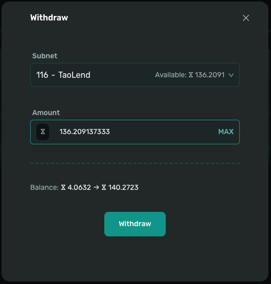

# Deposit and Withdraw

>This section explains how to deposit and withdraw assets on the Taolend platform.

## Overview

On Taolend, deposit and withdrawal workflows vary depending on your role:

- **Lender**: Deposit TAO to provide liquidity and earn interest
- **Borrower**: Deposit ALPHA as collateral to borrow TAO

## Prerequisites

Before depositing or withdrawing, make sure that:

- ✅ You have completed [asset bridging](bridge-assets.md)
- ✅ You have completed [account registration](registration.md)
- ✅ Your EVM wallet holds enough TAO to cover Gas fees
- ✅ You are familiar with the basic deposit and withdrawal flow

---

## Depositing TAO (Lender)

### Why Deposit TAO

Lenders must deposit TAO into the Taolend contract in order to:

- Create lending Offers
- Lend TAO to borrowers
- Earn interest income
- Receive staking or lending rewards from Subnet 116

### Deposit Process

#### Step 1: Access the Deposit Page

1. **Navigate to the "Profile" page**
   - Click **Profile** in the navigation bar
   - Open your profile page

2. **Click the Deposit button**
   - Locate the **Deposit** button
   - Click to proceed

3. **Select asset type**
   - Choose **Free Tao** or **0 - Root**
   - Review your current balance

#### Step 2: Enter the Deposit Amount

1. **Enter Amount**
   - Input the TAO Amount you want to deposit
   - Or click **Max** to deposit your full available Balance

2. **Review details**
   The system will display:
   - Wallet Balance
   - Contract Balance after deposit

#### Step 3: Confirm Deposit

1. **Submit Deposit**
   - Double-check all details
   - Click **Deposit**

2. **Confirm in wallet**
   - MetaMask will prompt a transaction confirmation
   - Click **Confirm**

3. **Wait for confirmation**
   - Block confirmation usually takes **10–30 seconds**
   - You can track the transaction in a block explorer

#### Step 4: Verify Deposit

1. **Check balances**
   - Your updated Balance will appear after confirmation
   - View contract assets on **Borrow / Assets** or **Profile**

2. **Confirm status**
   - Ensure TAO has moved from your wallet to the contract
   - You can now create a new Offer

---

## Depositing ALPHA (Borrower)

### Why Deposit ALPHA

Borrowers deposit ALPHA as collateral to:

- Borrow TAO for liquidity
- Participate in lending markets
- Access funds without selling ALPHA

### Deposit Process

#### Step 1: Access the Deposit Page

1. **Navigate to the "Profile" page**
   - Click **Profile** in the navigation bar

2. **Click the Deposit button**
   - Select **Deposit**

3. **Select Subnet**
   - Choose the Subnet where your ALPHA is located
   - For example: 116, 120

#### Step 2: Confirm Deposit

1. **Review details**
   The system will show:
   - ALPHA Balance in your wallet
   - Contract Balance after deposit

2. **Submit Deposit**
   - Verify all information
   - Click **Deposit**

3. **Confirm in wallet**
   - Approve the transaction in MetaMask

4. **Wait for confirmation**
   - Confirmation typically takes **10–30 seconds**

#### Step 3: Verify Deposit

1. **Check Balance**
   - View your ALPHA Balance on **Borrow / Assets**

2. **Review borrowing capacity**
   - The platform displays your maximum Borrow Amount in TAO
   - You can now proceed to the **Borrow** page

### 💡 Borrower Tips

- **Collateral size**: More ALPHA increases borrowing capacity
- **Validator staking**: Depositing via validators may earn staking rewards
- **Price risk**: ALPHA price affects borrow limits
- **Restrictions**: Collateralized ALPHA cannot be withdrawn before repayment

---

## Withdrawing TAO (Lender)

### When You Can Withdraw

Lenders can withdraw TAO under the following conditions:

- ✅ TAO not currently lent out
- ✅ Partial withdrawals while loans are active
- ✅ Full withdrawal after loans are repaid (principal + interest)

### Withdrawal Process

#### Step 1: Access the Withdrawal Page

1. **Navigate to "Profile"**
   - Click **Profile** in the navigation bar

2. **Click the Withdraw button**
   - Select **Withdraw**

3. **Select asset**
   - Choose **0 - Root**
   - Review available Balance

#### Step 2: Enter Withdrawal Amount

1. **Check available Balance**
   - Withdrawable Amount = Total Balance − Lent Amount

2. **Enter Amount**
   - Input the Amount to withdraw
   - Or click **Max**

3. **Review remaining Balance**

#### Step 3: Confirm Withdrawal

1. **Submit Withdraw**
   - Verify all details
   - Click **Withdraw**

2. **Confirm in wallet**
   - Approve the transaction in MetaMask

3. **Wait for confirmation**
   - Confirmation usually takes **10–30 seconds**

#### Step 4: Verify Receipt

1. **Check wallet Balance**
   - TAO will be transferred directly as Free Tao

2. **Confirm contract update**
   - Contract Balance decreases on **Borrow / Assets**
   - View transaction in the block explorer

### 💡 Lender Withdrawal Notes

- **Idle funds only**: Lent TAO cannot be withdrawn
- **Active loans**: Wait for repayment before withdrawing lent portions

---

## Withdrawing ALPHA (Borrower)

### When You Can Withdraw

Borrowers can withdraw ALPHA when:

- ✅ ALPHA is not used as collateral
- ✅ Loans are fully repaid
- ✅ Part of the deposit remains unused

### Withdrawal Process

#### Step 1: Check Loan Status

1. **Review active loans**
   - Check **Borrow / Active**
   - Repay loans before withdrawing collateral

2. **Confirm withdrawable Amount**
   - Withdrawable ALPHA = Total deposit − Collateral Amount

#### Step 2: Access the Withdrawal Page

1. **Navigate to "Profile"**

2. **Click Withdraw**

3. **Select Subnet**

#### Step 3: Enter Withdrawal Amount

1. **Review available Balance**
   - Collateralized ALPHA is excluded

2. **Enter Amount**
   - Or click **Max**

#### Step 4: Confirm Withdrawal

1. **Click Withdraw**

2. **Confirm in MetaMask**

3. **Wait for confirmation**

#### Step 5: Verify Receipt

1. **Check wallet Balance**
   - ALPHA is transferred to your wallet

2. **Confirm status**
   - Verify on **Borrow / Assets**
   - Review the transaction in the block explorer

### 💡 Borrower Withdrawal Notes

- **Collateral lock**: Repayment is required before withdrawal
- **Repayment first**: Clear loans before removing collateral
