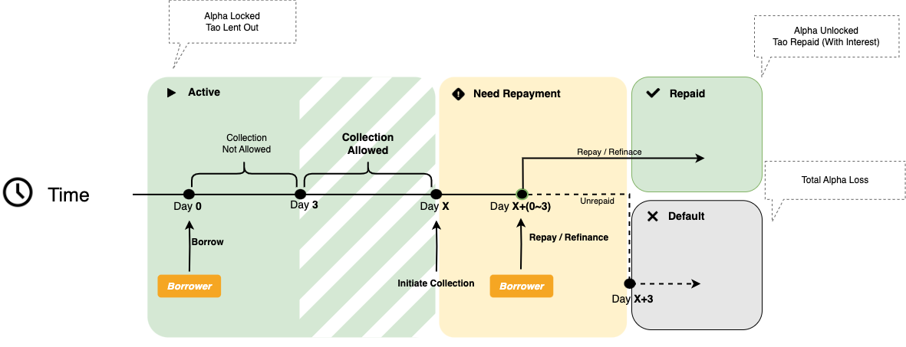
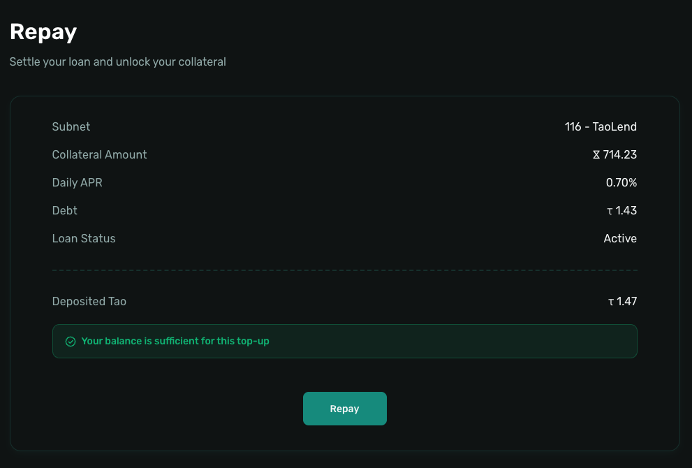
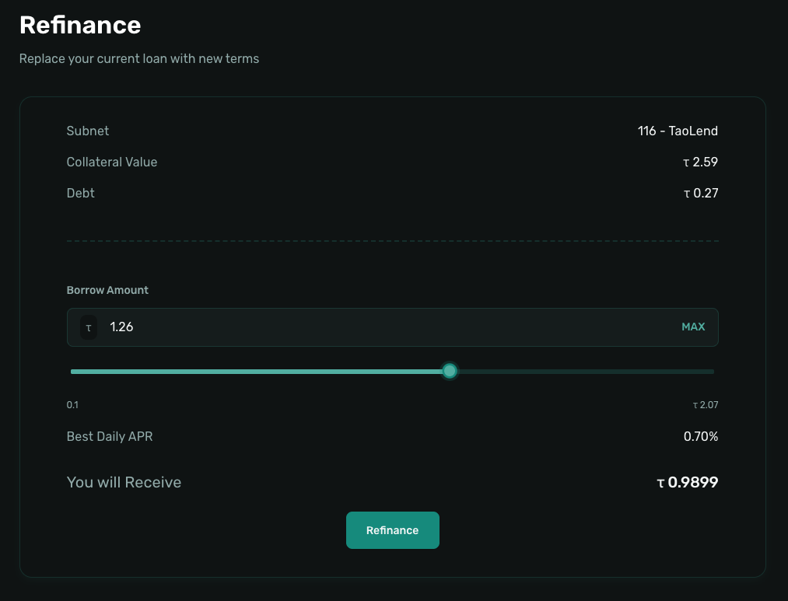

# Borrow

>This section explains how to borrow TAO to obtain liquidity as a borrower on the Taolend platform.

---

## Borrowing Overview

### What Is Borrowing

As a borrower, you can obtain TAO liquidity by collateralizing ALPHA (Bittensor Subnet tokens) provided by lenders. Taolend operates with a P2P Offer matching mechanism, where the system automatically matches you with the most favorable Offer available.

> ❗️Important Notice: After the initial 3-day protection period, a loan may enter collection at any time. Borrowers are strongly advised to monitor their loan status closely and pay attention to email notifications to avoid missing critical actions.

### Borrow Flow Diagram

<div align="center">
  
</div>

### How It Works

1. **Deposit ALPHA Collateral**
   - Deposit ALPHA into the Taolend smart contract
   - Collateral is fully managed by the smart contract

2. **Initiate Borrowing**
   - Select the Borrow Amount
   - The system automatically matches the best Offer (lowest Daily APR)
   - Borrow with one click, TAO is credited instantly

3. **Repay or Refinance**
   - Interest accrues daily and you may repay at any time
   - Optionally refinance into a better Offer
   - Collateral is automatically unlocked after repayment

### Costs and Fees

Borrowers are responsible for the following costs:

1. **Loan Interest**
   - Daily APR: 0.01% – 1% (set by lenders)
   - Calculated daily; longer durations result in higher interest

**Example**:
- Borrow Amount: 50 TAO
- Daily APR: 0.15%
- Duration: 15 days

```
Total Interest = 50 × 0.15% × 15 = 1.125 TAO
Amount Due = 51.125 TAO
```
---

## Preparation

### Step 1: Bridge Assets

Before borrowing, prepare the following:

1. **Bridge ALPHA**
   - Bridge ALPHA from the Bittensor network to an EVM network
   - Used as collateral

📖 See: [Bridge Assets](../account/bridge-assets.md)

### Step 2: Register Account

1. **Connect Wallet**
   - Visit [Taolend.io](https://Taolend.io)
   - Click **Connect Wallet**
   - Select MetaMask or another EVM wallet

2. **Register**
   - Navigate to **Profile**
   - Click **Register**
   - Sign message
   - Confirm registration transaction

📖 See: [Account Registration](../account/registration.md)

### Step 3: Deposit ALPHA

1. **Open Deposit**
   - Go to **Profile**
   - Click **Deposit**
   - Select the relevant Subnet

2. **Enter Amount**
   - Input the Collateral Amount
   - Ensure sufficient collateral

3. **Confirm**
   - Review details
   - Confirm in wallet
   - Wait ~10–30 seconds for confirmation

📖 See: [Deposit and Withdraw](../account/deposit-withdraw.md)

---

## Initiate Borrowing

<div align="center">
  
</div>


### Step 1: Open Borrow Page

1. Click **Borrow** in the navigation
2. Click **Borrow** to start

### Step 2: Configure Parameters


#### 2.1 Select Subnet

Choose the Subnet where ALPHA is deposited.

**Notes**:
- Only Subnets with available Balance are selectable
- The system displays your available Balance per Subnet

#### 2.2 Enter Collateral Amount

- Cannot exceed Subnet Balance
- Collateral is locked until repayment

**Maximum Borrow Calculation**:

```
Borrow Amount = Collateral Amount × ALPHA Price × Maximum Acceptable Price
```

>System uses 90% of ALPHA price as price protection.

**Example**:
- Collateral Amount: 1000 ALPHA
- ALPHA Price: 0.05 TAO
- Maximum Acceptable Price: 60%
- Borrow Amount: 1 ~ 30 TAO

#### 2.3 Enter Borrow Amount

- Minimum: **1 TAO**
- Cannot exceed calculated maximum

**Best Practice**:
- Avoid borrowing the full limit
- Maintain a safety buffer against price volatility

#### 2.4 Automatic Offer Matching

The system selects the Offer with:
- The Best Daily APR
- Sufficient Amount
- Matching Subnet and pricing conditions

### Step 3: Confirm Borrow

1. Review:
   - Borrow Amount
   - Collateral Amount
   - Daily APR

2. Click **Borrow**
3. Confirm transaction in wallet
4. Wait ~10–30 seconds
5. TAO is credited instantly and interest accrual begins

---

## Manage Loans

<div align="center">
  
</div>

### View Active Loans

1. Open **Borrow**
2. Switch to **Active**

### Loan Lifecycle

#### Phase 1: Active (0–3 days)
- Interest accrues daily
- Repayment available anytime
- No collection risk

#### Phase 2: Minimum Period Completed (After 3 days)
- Lenders may initiate collection
- Loan remains usable

#### Phase 3: Collection (3 days)
- Loan flagged for collection
- Repay or Refinance urgently

#### Phase 4: Overdue
- All ALPHA collateral is forfeited
- Collateral transferred to lender

---

## Repayment

<div align="center">
  
</div>

### Repay Loan

1. In **Borrow / Active**, click **Repay Loan**
2. Review:
   - Principal
   - Interest
   - Total Amount
3. If Balance is insufficient, click **Deposit**
4. Confirm transaction
5. Collateral unlocks immediately

---

## Refinancing

<div align="center">
  
</div>

### What Is Refinancing

Refinancing allows you to switch to a better Offer without manual repayment.

**Process**:
1. Identify a lower Daily APR Offer
2. Click **Refinance**
3. New Offer repays the old loan automatically
4. Any difference is settled
5. One transaction, lower cost

### Refinance Steps

1. Browse Market Offers
2. Click **Refinance**
3. Confirm new Offer details
4. Confirm transaction
5. New loan is active at lower rate

---

## Withdraw Collateral

After repayment:

1. Go to **Profile**
2. Click **Withdraw**
3. Select Subnet
4. Enter Amount or click **Max**
5. Confirm transaction
6. ALPHA is transferred to your wallet

📖 See: [Deposit and Withdraw](../account/deposit-withdraw.md)