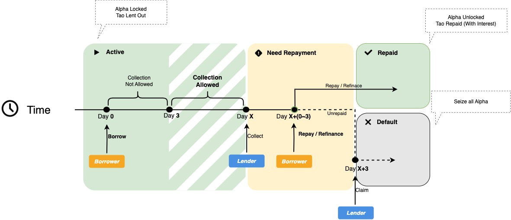
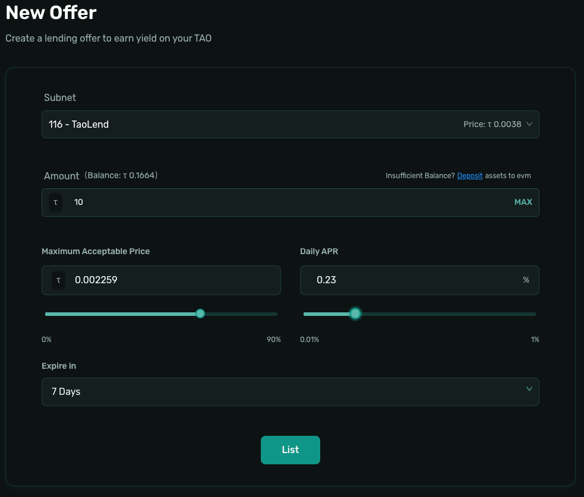
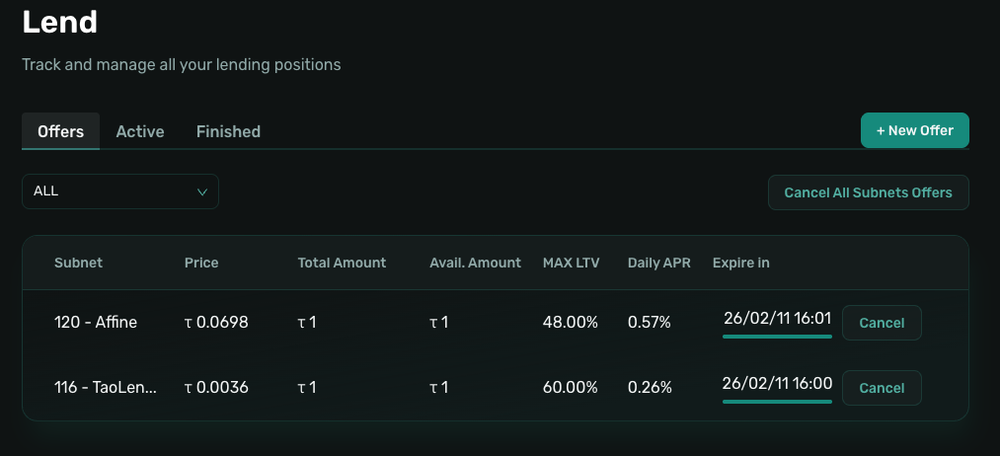
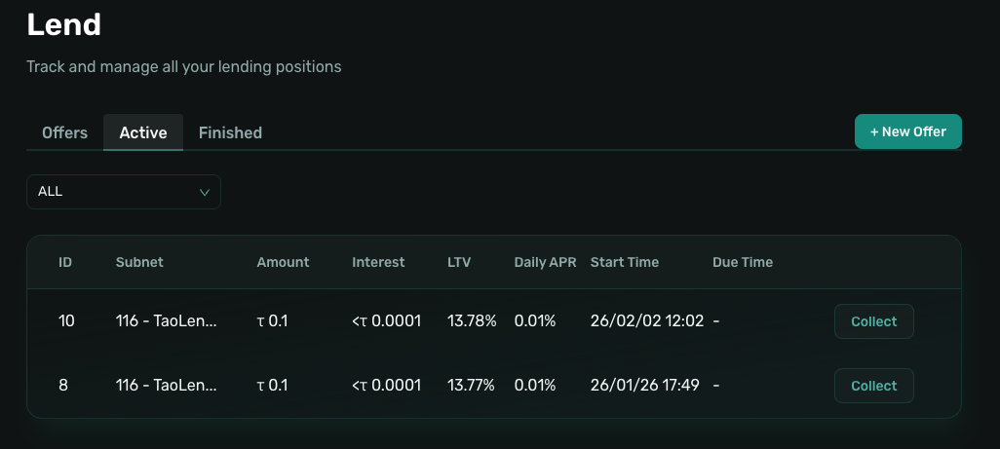

# Lend

>This section explains how to earn interest as a lender on the Taolend platform.

---

## Lending Overview

### What Is Lending

As a lender, you provide TAO to borrowers by creating Offers (lending orders) and earn interest in return. Taolend uses a P2P Offer matching model, giving you full control over lending terms.

### Lend Flow Diagram

<div align="center">
  
</div>

### Income Source

Lender income comes from interest paid by borrowers:

```
Interest paid by borrower = Borrow Amount × Daily APR × Days
Lender earnings = Total interest × 70%
Protocol fee = Total interest × 30%
```

**Example**:
- Borrow Amount: 100 TAO
- Daily APR: 0.1%
- Duration: 30 days

```
Total interest = 100 × 0.1% × 30 = 3 TAO
Lender earnings = 3 × 70% = 2.1 TAO
Protocol fee = 3 × 30% = 0.9 TAO
```

### Offer Mechanism

**What Is an Offer**:
- An Offer is a lending order you create
- It includes Amount, Daily APR, Subnet, collateral requirements, and other terms
- Signed off-chain (no on-chain transaction)
- Borrowers can browse and Accept Loan directly

**Offer Advantages**:
- ✅ Free to create
- ✅ Becomes active immediately and visible in the Market
- ✅ Supports multiple Offers with different conditions
- ✅ Can be cancelled at any time (cancellation is on-chain)

---

## Preparation

### Step 1: Bridge TAO

Before lending, you need TAO on the EVM network:

1. **Bridge TAO**
   - Bridge TAO from the Bittensor network to an EVM network

📖 See details: [Bridge Assets](../account/bridge-assets.md)

### Step 2: Register an Account

1. **Connect Wallet**
   - Visit [Taolend.io](https://Taolend.io)
   - Click **Connect Wallet**
   - Choose MetaMask or another supported wallet

2. **Register**
   - Go to the **Profile** page
   - Click **Register**
   - Sign a message (off-chain)
   - Confirm the registration transaction 

📖 See details: [Account Registration](../account/registration.md)

### Step 3: Deposit TAO

1. **Open Deposit**
   - Go to **Profile**
   - Click **Deposit**
   - Select **Free Tao** or **0 - Root**

2. **Enter Amount**
   - Input the Amount you plan to lend
   - Or click **Max**

3. **Confirm**
   - Review details
   - Confirm the transaction in your wallet
   - Wait for confirmation (about 10–30 seconds)

📖 See details: [Deposit and Withdraw](../account/deposit-withdraw.md)

---

## Create Offer



### Step 1: Open Lend Page

1. Click **Lend** in the navigation bar
2. Review existing Offers in the Market
3. Click **+ New Offer**

### Step 2: Configure Offer Parameters

#### 2.1 Select Subnet

Choose the Subnet of the ALPHA collateral you are willing to accept.

**Common Subnets**:
- Subnet 116
- Subnet 120

**Tips**:
- Choose Subnets you understand
- ALPHA prices and risks vary by Subnet
- You can create multiple Offers for different Subnets

#### 2.2 Set Amount

Set the maximum TAO Amount you are willing to lend.

**Rules**:
- Minimum Amount: 1 TAO
- Cannot exceed your Balance
- You may lend less than your total Balance

#### 2.3 Set Daily APR

Define the Daily APR for the loan.

> 💡 **Note**: Interest is calculated per block (1 day = 7,200 blocks). Daily APR is an equivalent display value.

**Range**: 0.01% – 1%

| Daily APR | Monthly (≈) | Annual (≈) | Risk |
|----------|-------------|------------|------|
| 0.05% | 1.5% | 18% | Low |
| 0.1% | 3% | 36% | Medium-Low |
| 0.2% | 6% | 72% | Medium |
| 0.5% | 15% | 180% | Medium-High |
| 1% | 30% | 365% | High |

**Pricing Tips**:
- Compare with other Offers in the Market
- Lower APR increases acceptance probability
- Adjust APR based on Subnet risk
- Consider ALPHA price volatility

#### 2.4 Set Maximum Acceptable Price

Set the Maximum Acceptable Price for ALPHA.

**Why It Matters**:
- Prevents overvaluation of collateral
- ALPHA prices are market-driven and volatile
- The protocol applies a 90% safety margin

**Best Practices**:
- Reference current and historical ALPHA prices
- Lower caps increase safety but reduce attractiveness
- Balance risk and competitiveness

#### 2.5 Set Expire in

Choose how long the Offer remains valid.

**Options**:
- 1 day
- 3 days
- 7 days
- 30 days

Expired Offers are automatically invalid and can be cancelled anytime before expiration.

### Step 3: List Offer

1. Review all parameters carefully
2. Click **List**
3. Sign the message in your wallet (off-chain)
4. The Offer becomes active immediately and visible in the Market

---

## Manage Offers

<div align="center">
  
</div>

### View Offers

On the **Lend** page, you can see:
- Active Offers
- Remaining Amount
- Daily APR
- Expire in

### Cancel Offer

1. Locate the Offer in **Lend**
2. Click **Cancel**
3. Confirm the on-chain transaction

**Notes**:
- Accepted portions cannot be cancelled
- Only unused Amount can be withdrawn

### Batch Cancel

- Select multiple Offers
- Click **Cancel All Subnets Offers**
- Complete in a single transaction

### Offer Available Balance

#### When Loan is Repaid

- ✅ When a borrower repays the loan (before collection or after), the **available balance** of your Offer **will be restored**
- The used amount returns to your Offer pool and becomes available for other borrowers
- You can continue lending with the same Offer

#### When Loan is Defaulted

- ⚠️ When a loan enters **Collection** and remains unpaid (even after collection grace period), the **available balance of your Offer will NOT be restored**
- The locked amount remains unavailable until the collateral is claimed
- This amount cannot be used for new loans until the old loan is fully settled

---

## Manage Loans

<div align="center">
  
</div>

### Active Loans

When a borrower Accepts Loan:

1. Go to **Lend → Active**
2. View details:
   - ID
   - Borrow Amount
   - Daily APR
   - Start time
   - Accrued interest
   - Collateral Amount and Subnet
   - Status (Active / Collection / Finished)

### Collection

#### When You Can Collect

- **0–3 days**: Minimum duration, collection not allowed
- **After 3 days**: You may initiate collection
- **Collection period**: 3 days for borrower repayment
- **Afterward**: Collateral can be claimed

#### How to Collect

1. Select an eligible loan
2. Click **Collect**
3. Confirm the transaction on-chain

#### Claim Collateral

If the borrower fails to repay:
1. Click **Claim**
2. Confirm the transaction
3. ALPHA collateral is transferred to your account

---

## Withdraw Earnings

### Check Balance

In **Profile**, view:
- Balance
- Lent Amount
- Withdrawable Amount

### Withdraw

1. Click **Withdraw**
2. Select **0 - Root**
3. Enter Amount or click **Max**
4. Confirm the transaction

📖 See details: [Deposit and Withdraw](../account/deposit-withdraw.md)
