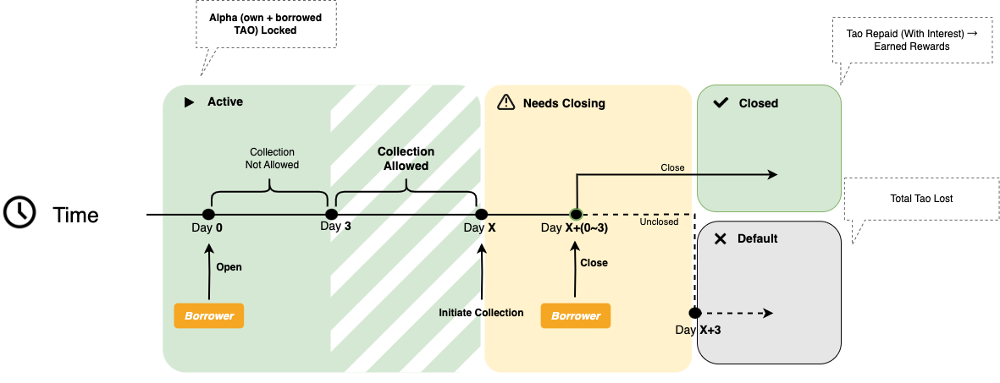
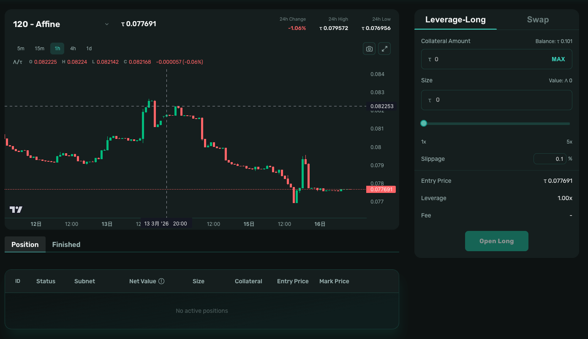
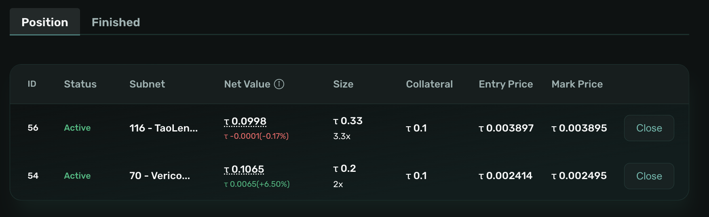
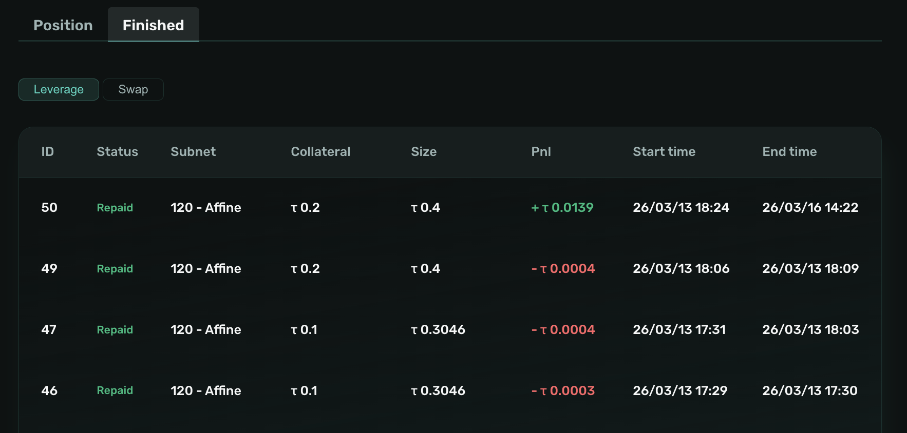
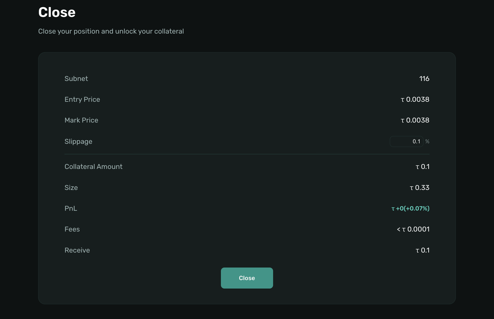

# Leverage-Long

> This section explains how to open and manage leveraged positions on the Taolend platform using TAO and ALPHA.

---

## Leverage Overview

### What Is Leverage Trading

Leverage trading allows you to amplify your exposure to Alpha token price movements by combining your own TAO with borrowed TAO to purchase more Alpha than your capital alone would allow.

When Alpha price rises, your leveraged position amplifies the gains:
- Without leverage: 1× exposure to Alpha price increase
- With 3× leverage: 3× exposure to the same price increase

**Example (Profitable Position)**:
- Collateral: 10 TAO, Leverage: 3×, Total Size: 30 TAO worth of Alpha
- Alpha price increases 20%
- Profit: 30 TAO × 20% = 6 TAO (vs. 2 TAO without leverage)

> ❗️ Important Notice: If a lender initiates collection on your leveraged position, you must **close your position immediately**. Failure to close before the 3-day grace period expires will result in liquidation and **total loss of your principal**. Monitor your positions closely at all times.

### Leverage Flow Diagram

<div align="center">
  
</div>

### How It Works

Opening a leveraged position executes the following steps automatically:

1. **Collateralize TAO** — Your own TAO is locked as collateral
2. **Borrow TAO** — Additional TAO is borrowed from lenders on your behalf
3. **Buy Alpha** — Combined TAO is used to purchase Alpha tokens from the market
4. **Collateralize Alpha** — Purchased Alpha is deposited as collateral to secure the loan

### Costs and Fees

You are responsible for the following costs:

1. **Loan Interest**
   - Daily APR: 0.01% – 1% (set by lenders)
   - Calculated per block; longer durations result in higher interest

**Example**:
- Collateral: 10 TAO, Leverage: 3×, Borrowed: 20 TAO
- Daily APR: 0.15%
- Duration: 10 days

```
Total Interest = 20 × 0.15% × 10 = 0.3 TAO
```

---

## Preparation

### Step 1: Bridge Assets

Before opening a leverage position, prepare the following:

1. **Bridge TAO**
   - Bridge TAO from the Bittensor network to the EVM network
   - Used as your collateral to open a position

📖 See: [Bridge Assets](../account/bridge-assets.md)

### Step 2: Register Account

1. **Connect Wallet**
   - Visit [Taolend.io](https://Taolend.io)
   - Click **Connect Wallet**
   - Select MetaMask or another EVM wallet

2. **Register**
   - Navigate to **Profile**
   - Click **Register**
   - Sign message
   - Confirm registration transaction

📖 See: [Account Registration](../account/registration.md)

### Step 3: Deposit TAO

1. **Open Deposit**
   - Go to **Profile**
   - Click **Deposit**
   - Select **Free TAO**

2. **Enter Amount**
   - Input the amount to use as collateral

3. **Confirm**
   - Review details
   - Confirm in wallet
   - Wait ~10–30 seconds for confirmation

📖 See: [Deposit and Withdraw](../account/deposit-withdraw.md)

---

<div align="left">
  
</div>

## Open a Leverage-Long Position

### Step 1: Open Leverage Page

1. Click **Trade** in the navigation
2. Click **Leverage-Long** to start

### Step 2: Configure Parameters

#### 2.1 Enter Collateral Amount

Input the amount of TAO you want to use as your own capital for this position.

- Cannot exceed your available TAO Balance
- This is the maximum amount you can lose if the position is liquidated

#### 2.2 Adjust Leverage

Use the leverage slider to set your desired multiplier. The system automatically calculates the position size:

```
Borrowed TAO  = Collateral Amount × (Leverage - 1)
Total TAO     = Collateral Amount × Leverage
Size (Alpha)  = Total TAO / Alpha Price
```

**Example**:
- Collateral Amount: 10 TAO
- Leverage: 3×
- Borrowed TAO: 20 TAO
- Alpha Price: 0.05 TAO
- Size: 600 Alpha

> Higher leverage means greater potential profit — and greater potential loss. Start with lower leverage if you are new to leverage trading.

#### 2.3 Set Slippage

Slippage tolerance controls the maximum acceptable price deviation when buying Alpha.

- If the actual execution price deviates beyond your slippage setting, the transaction will be cancelled automatically
- Recommended: **0.5% – 2%** for normal market conditions
- Increase slippage during high volatility to ensure execution

#### 2.4 Review Position Summary

Before confirming, review the key parameters:

| Parameter | Description |
|-----------|-------------|
| Collateral Amount | Your own TAO locked in the position |
| Leverage | Multiplier applied to your capital |
| Borrowed TAO | TAO borrowed from lenders |
| Size | Alpha tokens to be purchased |
| Entry Price | Expected Alpha purchase price |
| Slippage | Maximum acceptable price deviation |
| Estimated Interest | Daily cost of the borrowed TAO |

### Step 3: Confirm Open Long

1. Click **Open Long**
2. Confirm the transaction in your wallet
3. Wait ~10–30 seconds for confirmation
4. The system executes: collateralize TAO → borrow TAO → buy Alpha → collateralize Alpha
5. Your position is now active and interest accrual begins

---

## Manage Positions

<div align="center">
  
</div>


### View Active Positions

1. Open **Trade**
2. Switch to **Position** or **Finished**

You can view:
- Current position size and entry price
- Net Value: Collateral + PnL - Borrow Fee
- Current Alpha price and unrealized P&L

<div align="center">
  
</div>

### Position Lifecycle

#### Phase 1: Active (0–3 days)
- Interest accrues per block
- Position can be closed at any time
- No collection risk during this period

#### Phase 2: Minimum Period Completed (After 3 days)
- Lenders may initiate collection at any time
- Position remains open; monitor Alpha price and interest accrual closely

#### Phase 3: Collection (3-day grace period)
- Your position has been flagged for collection by a lender
- **Close your position immediately**
- You still have time to sell Alpha, repay the loan, and recover your remaining principal

> ❗️ Do not wait. Every block of delay risks further price movement. Close the position as soon as you receive a collection notification.

#### Phase 4: Overdue
- Grace period has expired without action
- All Alpha collateral is forfeited to the lender
- **Total loss of your principal**

---

### Close Steps

<div align="center">
  
</div>

#### Step 1: Open Trade → Position

1. Click **Trade** in the navigation
2. Switch to the **Position** tab
3. Find the active position and click the **Close** button

#### Step 2: Review & Confirm Parameters

A confirmation panel will appear. Review the current price, set slippage tolerance, and preview the estimated return.

#### Step 3: Set Slippage

#### Step 4: Confirm

Confirm the transaction in your wallet and wait for the transaction to complete. Returned TAO is credited to your balance immediately.

After closing, you may withdraw your TAO balance via **Profile → Withdraw**.

📖 See: [Deposit and Withdraw](../account/deposit-withdraw.md)
