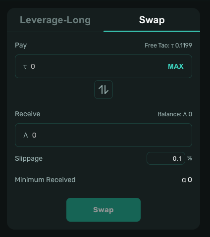

# Swap

> Swap allows you to instantly exchange between TAO and Alpha tokens directly on the Trade page.

---

## How It Works

1. Select the token you want to sell (**Pay**) and enter the amount
2. The system automatically calculates the amount you will receive (**Receive**)
3. Review the **Slippage** and **Minimum Received** values
4. Click **Swap** to execute the trade

>  Only Free tao and wallet ALPHA is eligible for swap.

---

## Parameters

| Field | Description |
|-------|-------------|
| Pay | The token and amount you are selling |
| Receive | The token and estimated amount you will receive |
| Slippage | Maximum acceptable price deviation (recommended: 0.1% – 1%) |
| Minimum Received | The lowest amount you will receive, calculated based on Slippage |

> If the actual execution price moves beyond the Slippage tolerance, the transaction will be cancelled automatically to protect you from unfavorable rates.

---

## Steps

  

1. Click **Trade** in the navigation and select the **Swap** tab
2. Select the **Pay** token and enter the amount
3. Confirm the estimated **Receive** amount
4. Adjust **Slippage** if needed
5. Click **Swap** and confirm the transaction in your wallet
6. Wait ~10–30 seconds — tokens are credited to your wallet immediately
