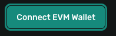
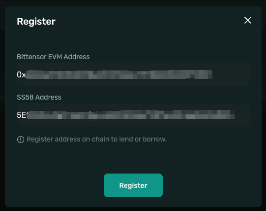
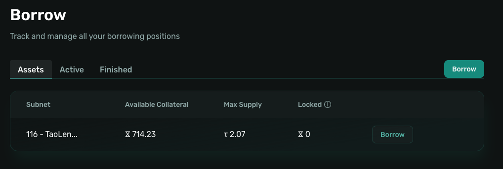
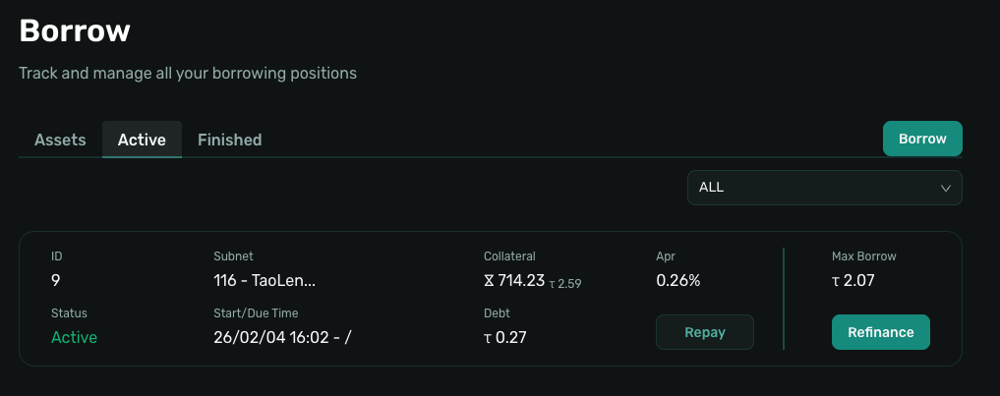

# Quick Start - Borrow

> This guide will help you start borrowing on Taolend using your ALPHA as collateral in just 5 minutes.

## Prerequisites

Before you begin, make sure you have the following ready:

- ✅ **EVM Wallet** (e.g. MetaMask)
- ✅ **Bittensor Wallet**
- ✅ ALPHA tokens on the Bittensor chain
- ✅ Sufficient gas fees in your EVM wallet

## Step Zero: Bridge Assets to Your EVM Account

⚠️ **Important**: Before using Taolend, you must bridge your assets from the Bittensor chain to your EVM account.

Taolend operates on the **Bittensor EVM chain**, so your ALPHA tokens must be bridged from the Bittensor native chain first. This allows you to:
- Manage assets using EVM wallets like MetaMask
- Participate in borrowing activities on Taolend
- Access sufficient gas fees for on-chain transactions

👉 **For detailed bridging instructions**, please refer to [Bridge Assets Guide](account/bridge-assets.md)

---

## Borrower Quick Guide

### Step 1: Connect Wallet and Register

1. **Access the Platform**
   - Open the Taolend website
   - Click **Connect Wallet**

  

2. **Connect Your EVM Wallet**
   - Choose MetaMask (or another EVM wallet)
   - Confirm the connection

3. **Complete Registration**
   - Go to **Profile** and click **Register**
   - Sign an message
   - Confirm the on-chain registration transaction

  

### Step 2: Deposit ALPHA as Collateral

1. **Go to the Profile Page**
   - Click **Deposit**

2. **Select Subnet**
   - Choose the Subnet where your ALPHA is held
   - Example: Subnet 116, Subnet 120

3. **Enter Collateral Amount**
   - Input the ALPHA Amount you want to deposit
   - Higher collateral allows a higher Borrow Amount

4. **Complete Deposit**
   - Click **Deposit**
   - Confirm the transaction and wait for completion

### Step 3: Borrow TAO

1. **Go to the Borrow Page**
   - Click **Borrow**
   - Or access via **Borrow → Assets**

  

2. **Initiate Borrowing**
   - Click **Borrow** on the desired asset

3. **Select Parameters**
   - Choose the Subnet
   - Enter the Collateral Amount

4. **Set Borrow Amount**
   - Enter the Borrow Amount
   - The system automatically matches the offer with the **Best Daily APR**

5. **Confirm Borrow**
   - Review loan details and interest
   - Confirm the transaction in your wallet

  

### Step 4: Manage Your Loan

  

1. **Receive TAO**
   - TAO is transferred instantly to your wallet
   - Collateral is locked in the contract
   - Interest accrues daily

2. **Track Loan Status**
   - Go to **Borrow → Active**
   - View loan balance, accrued interest, and repayment details

3. **Repay or Refinance**

   **Repay Loan**:
   - Ensure enough TAO is available in your Balance
   - Click **Repay Loan**
   - Confirm principal + interest
   - Collateral is unlocked automatically

   **Refinance**:
   - Choose **Refinance** if a better offer is available
   - The new loan repays the old one in a single transaction
