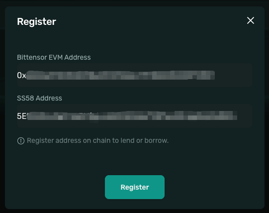
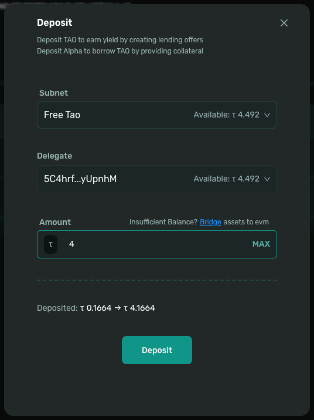

# Quick Start - Leverage-Long

> This guide will help you open a leveraged long position on Taolend in just 5 minutes.

## Prerequisites

Before you begin, make sure you have the following ready:

- ✅ **EVM Wallet** (e.g. MetaMask)
- ✅ **Bittensor Wallet**
- ✅ TAO tokens on the Bittensor chain
- ✅ Sufficient gas fees in your EVM wallet

## Step Zero: Bridge Assets to Your EVM Account

⚠️ **Important**: Before using Taolend, you must bridge your assets from the Bittensor chain to your EVM account.

Taolend operates on the **Bittensor EVM chain**, so your TAO tokens must be bridged from the Bittensor native chain first. This allows you to:
- Manage assets using EVM wallets like MetaMask
- Participate in leverage trading on Taolend
- Access sufficient gas fees for on-chain transactions

👉 **For detailed bridging instructions**, please refer to [Bridge Assets Guide](account/bridge-assets.md)

---

## Leverage-Long Quick Guide

### Step 1: Connect Wallet and Register

1. **Access the Platform**
   - Open the Taolend website
   - Click **Connect Wallet** in the top-right corner

<div align="left">
  
</div>

2. **Connect Your EVM Wallet**
   - Choose MetaMask (or another EVM wallet)
   - Confirm the connection in your wallet

3. **Complete Registration**
   - Go to the **Profile** page and click **Register**
   - Sign a message to verify your identity
   - Confirm the signature in your wallet
   - **Confirm the registration transaction**
   - Wait for confirmation — registration is complete

<div align="left">
  
</div>

### Step 2: Deposit TAO

1. **Go to the Profile Page**
   - Click **Deposit**
   - Select **Free TAO**

<div align="left">
  
</div>

2. **Enter Amount**
   - Enter the TAO amount you want to use as collateral

3. **Complete Deposit**
   - Click **Deposit**
   - Confirm the transaction in your wallet
   - Wait for confirmation (about 10–30 seconds)

### Step 3: Open a Leverage-Long Position

1. **Go to the Trade Page**
   - Click **Trade** in the navigation
   - Select **Leverage-Long**

<div align="left">
  
</div>

2. **Configure Position Parameters**

   - **Collateral Amount**: Input the amount of TAO you want to use as collateral for this position
   - **Leverage**: Adjust the multiplier — the system automatically calculates your position size:
     ```
     Borrowed TAO  = Collateral Amount × (Leverage - 1)
     Total TAO     = Collateral Amount × Leverage
     Size (Alpha)  = Total TAO / Alpha Price
     ```
   - **Slippage**: Set the maximum acceptable price deviation for the Alpha purchase (recommended: 0.5% – 2%)

   **Example**:
   - Collateral: 10 TAO, Leverage: 3×
   - Borrowed: 20 TAO, Total: 30 TAO
   - Size: 600 Alpha at 0.05 TAO/Alpha

3. **Confirm Open Long**
   - Review Collateral Amount, Leverage, Size, and estimated interest
   - Click **Open Long**
   - Confirm the transaction in your wallet
   - Wait ~10–30 seconds — your position is now active

### Step 4: Manage Your Position

1. **View Active Positions**
   - Go to **Trade → Active**
   - Track your position size, entry price, accrued interest, and current P&L

2. **Close for Profit**

   When Alpha price has risen, close your position to realize gains:
   - Click **Close** on your active position
   - The system sells Alpha, repays the borrowed TAO + interest automatically
   - Remaining TAO (your principal + profit) is credited to your balance

   **Example**:
   - Opened with 10 TAO collateral, 3× leverage, bought 600 Alpha at 0.05 TAO
   - Alpha rises to 0.06 TAO → position worth 36 TAO
   - Repay 20 TAO loan + interest → ~15.7 TAO returned
   - Net profit: ~5.7 TAO on 10 TAO principal

3. **Close at a Loss if Needed**

   If Alpha price has fallen, closing still recovers your remaining collateral after loan repayment — always better than waiting for collection.

4. **Monitor for Collection Risk**

   > ❗️ Lenders can trigger a claim signal starting 3 days after the loan begins. A claim signal starts a 3-day countdown. If you don't close your position in time, ALL ALPHA collateral will be forfeited to the lender. Act IMMEDIATELY if you see IN_COLLECTION!
